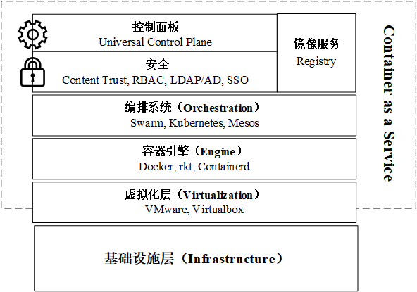
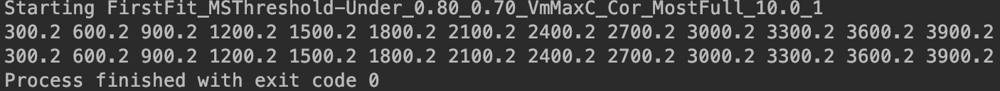
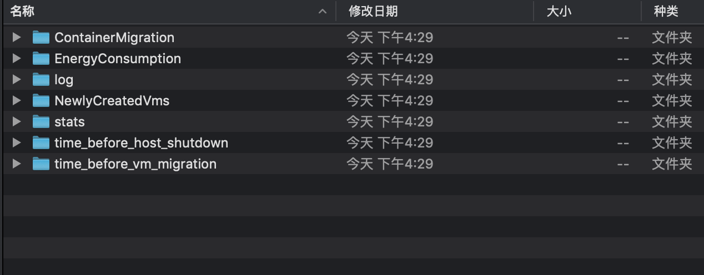

# paperlab

主要包含两部分内容：
1. predict，提出基于趋势感知的区间预测模型对容器负载进行预测，并与主流的贝叶斯、线性回归、回归数、随机森林和SVM进行对比实验；
2. ccsim，对CloudSim进行扩展，并进行与容器能耗优化调度有关的实验。

# predict

## 简介

在云计算场景中，云服务种类的多样造成不同容器其负载变化趋势的多样，甚至对同一容器来说，在不同时期，其负载变化趋势也是不同的。例如有些容器的负载是平
稳的、有些是具有上升/下降趋势的、还有些是不断进行周期性波动的。

针对这一问题，提出了基于趋势感知的区间预测模型（SAC-GPSO-SVM）。首先，通过分析容器负载时序数据的频谱特征（Spectrum Analysis）和
自相关系数（Autocorrelation Coefficient）（简称SAC规则），对容器负载变化特征进行分类，即趋势感知。再依据分类结果，采用不同方法将原先时序
数据的单值序列转变为时序数据的区间序列，这一步避免了如传统区间预测模型一样，对不同负载类型作同一种分布假设，从而提升了预测的准确性。
由于SVM方法具有能处理高维空间的非线性映射、剔除“冗余”样本增强鲁棒性以及简化回归提升算法效率等优点，因此，
更适合用于将预测结果作为资源配置和调度决策依据的场景。最后将基于SVM方法来给出容器负载的预测域，并采用带梯度信息的粒子群算法来优化模型参数。

实验采用的数据为：**PlanetLab从2011-03-03～2011-04-20的容器负载数据**

SAC-GPSO-SVM模型的主要流程为：
1. 区间构造。负载监控软件采样获得的容器负载数据一般是单值序列，通过区间构造，可将其转化为相应的区间序列，即包含负载上下界的时序数据；
2. 区间预测。使用SVM对上一过程生成的区间序列的上下界分别进行预测，并使用带梯度信息的粒子群算法对模型参数进行优化，最后获得容器负载的预测域。

## 实验数据介绍
使用的实验数据为公开数据集PlanetLab从2011年03月03日到2011年04月20日共10天的11746个容器的CPU利用率的历史数据。
每份数据都记录了当日每5分钟内容器CPU利用率的平均值，共计287个数据点。如下表所示

|  编号 |   目录   | 文件数   |   
|-------|----------|--------|
|   0   | 20110403 |  1463  |
|   1   | 20110303 |  1052  |
|   2   | 20110420 |  1033  |
|   3   | 20110411 |  1233  |
|   4   | 20110409 |  1358  |
|   5   | 20110325 |  1078  |
|   6   | 20110322 |  1516  |
|   7   | 20110306 |  898   |
|   8   | 20110309 |  1061  |
|   9   | 20110412 |  1054  |
| Total |          | 11746  |

## 模块介绍
### python 模块
- read_data.py：读取数据模块
- adf_test.py：序列初始化分析以及平稳性检验模块
- wta.py：趋势感知模块
- ic.py：区间构造模块
- pso_svm.py：SAC-GPSO-SVM模型的参数优化和区间预测模块
- metrics.py：区间覆盖率与区间宽度等预测结果评价指标模块
- predict_fx.py：对比算法实现模块

### jupyter-book文件
jupyter-book文件可作为实验中的可执行文件，直接在服务器中运行完整实验

实验文件

- /predict/01_bayesian_predict.ipynb：使用贝叶斯模型进行预测
- /predict/02_linear_regression.ipynb：使用线性回归模型进行预测
- /predict/03_cart_predict.ipynb：使用回归树模型进行预测
- /predict/04_svm_predict.ipynb：使用SVM模型进行预测
- /predict/05_rfr_predict.ipynb：使用随机森林模型进行预测
- /predict/06_pso-svm_predict.ipynb：使用SAC-GPSO-SVM模型进行预测
- /predict/data_detail.ipynb：分析实验数据（PlanetLab的容器数据）规律
- /predict/grid_random_pso.ipynb：参数优化实验
- /predict/time_compare.ipynb：模型理论预测时间对比
- /predict/xxx_model_plot.ipynb：实验结果画图

测试文件

- /predict/cal_load_coef.ipynb：测试计算实验数据（PlanetLab）的自相关系数
- /predict/construct_interval.ipynb：测试构建区间
- /predict/find_period_load.ipynb：测试寻找负载数据周期性
- /predict/find_smooth_load.ipynb：测试寻找负载数据平稳性和趋势性
- /predict/svm_predict.ipynb：测试SVM预测方法

### 结果文件

- /predict/README.txt：原始数据特征分析结果
- /predict/fig：实验结果示意图
- /predict/fig_out：实验结果示意图（word级别）

# ccsim

## 简介

容器技术正在不断改变软件开发的模式，以目前最常用的容器引擎Docker为例，它允许开发人员将许多现有的业务或是应用程序容器化。由于容器间
共享与主机相同的内核，因此虽然容器能在工作负载之间提供隔离层，但是却没有基于管理程序的虚拟化开销，从这一层面上来说，与虚拟机相比，容
器可被认定为更轻量级的虚拟化环境。

由于对计算资源弹性、可用性和可扩展性的要求，政府、企业和个人越来越多地采用云计算来托管应用程序。除了传统的云服务外，即基础设施即服务
（IaaS）、平台即服务（PaaS）和软件即服务（SaaS）外，随着容器技术的发展近几年还出现了一种新型的服务模式——容器即服务（CaaS）。

CaaS是介于IaaS和PaaS的中间层。在过去，IaaS仅提供虚拟化的计算资源，PaaS提供特定于应用程序的运行时服务，而现在CaaS则通过容器为
需要部署的应用程序（或应用程序的不同模块）提供隔离环境，有效地将IaaS和PaaS这两层结合在一起目前，CaaS服务通常运行在
IaaS的虚拟机之上。CaaS提供商（例如Google和AWS）认为容器为半可信工作负载提供了适当的环境，而虚拟机为不受信任的工作负载提供了另一
层安全性。

确保云服务的QoS同时，有效避免能源浪费和资源碎片化是云系统中的资源管理策略的不可或缺的主要功能。为了能对比资源管理策略的性能，需要一种
有助于评估实验设计的，同时能使实验过程具有可重复性和准确性的实用工具。CloudSim就是这样一种在云环境中构建资源管理策略评估的模拟工具，
在研究的早期阶段，它可以有效识别和消除无效的策略，并且不需要直接访问真实的大规模分布式系统。

CloudSim4.0版本（ContainerCloudSim）中加入了对CaaS环境中资源管理技术仿真的支持，提供了一个评估例如容器调度、放置和容器合并的容
器资源管理技术的环境。但它也存在着一些缺点，比如，仿真虚拟机生成容器的过程比较粗旷，直接以静态方式分配处理器的MIPS，而没要考虑CPU资
源是可以进行压缩的。因此本项目对ContainerCloudSim进行了部分组件的扩展，使仿真过程更接近容器实际运行的情况。

## 模块介绍

### paperlab.ccsim.core

核心组件模块，主要包含对CaaS数据中心、数据中心代理（用于代替用户向数据中心提交任务请求）、物理主机、虚拟机、容器本身和容器
上的工作负载的抽象

- `ContainerHost`：模拟物理主机，负责给虚拟机分配资源，并更新虚拟机当前运行状态（CPU利用率等）；
- `ContainerVm`：模拟虚拟机，负责给容器分配资源，并更新容器当前运行状态（CPU利用率等）；
- `Container`：模拟容器，负责给工作负载分配资源，并更新工作负载当前运行状态（CPU利用率等）。一般情况下，一个容器内部同一时间
仅运行单个工作负载。在仿真过程中，工作负载完成任务后，其所在的容器不会立刻销毁，而是经过重新初始化后，继续作为下一个工作负载的运行空间。
这样做的目的是，1）节约仿真时间；2）缓解JVM堆内存压力。因为当仿真规模较大时，在JVM中频繁地创建对象和分配内存空间不仅会消耗大量时间，
而且会造成堆内存中对象过多，空间复杂度增加；
- `ContainerCloudlet`：模拟工作负载，cloudlet的任务长度、需要的处理器个数以及多资源利用率模型需要在对象初始化时设置；
- `ContainerDatacenter`：模拟CaaS数据中心，循环处理事件队列，推进仿真过程执行；
- `ContainerDatacenterCharacteristics` ：数据中心属性；
- `ContainerDatacenterBroker`：模拟数据中心代理，负责代替用户向数据中心提交任务请求，它也是整个仿真过程事件流的发起者；
- `PowerContainerHostZipped`：对`ContainerHost`的扩展，允许CPU资源压缩；
- `PowerContainerVMZipped`：对`ContainerVm`的扩展，允许CPU资源压缩。

### paperlab.ccsim.containerVmProvisioners

主机资源供给模块，负责模拟CPU、内存、网络带宽资源向虚拟机供给的过程

- `ContainerVmPeProvisioner`：模拟CPU资源供给，不允许超量使用CPU资源；
- `ContainerVmRamProvisioner`：模拟内存资源供给；
- `ContainerVmBwProvisioner`：模拟网络带宽资源供给。

### paperlab.ccsim.containerProvisioners

虚拟机资源供给模块，负责模拟CPU、内存、网络带宽资源向容器供给的过程

- `ContainerPeProvisioner`：模拟CPU资源供给，不允许超量使用CPU资源；
- `ContainerRamProvisioner`：模拟内存资源供给；
- `ContainerBwProvisioner`：模拟网络带宽资源供给。

### paperlab.ccsim.provisioners

扩展资源供给模块，扩展了虚拟机和容器中的CPU资源供给模块，运行超量使用CPU

- `ContainerVmPeProvisionerZipped`：主机分配计算资源给虚拟机的方案，当VM需求的MIPS大于可提供的MIPS时，会根据各虚拟机总需求的占
比对分配方案进行压缩；
- `ContainerPeProvisionerZipped`：虚拟机分配计算资源给容器的方案，当容器需求的MIPS大于可提供的MIPS时，会根据各容器总需求的占
比对分配方案进行压缩。

### paperlab.ccsim.schedulers

对虚拟机、容器、工作负载进行资源分配和管理

- `ContainerVmScheduler`：抽象类，负责虚拟机资源管理和分配；
- `ContainerVmSchedulerTimeShared`：基于时间共享但不允许CPU超量使用的资源管理方案；
- `ContainerVmSchedulerTimeSharedOverSubscription`：允许CPU超量使用但未做处理的资源管理方案；
- `ContainerVmSchedulerTimeSharedOverSubscriptionZipped`：允许CPU超量使用且通过MIPS压缩进行处理的的资源管理方案；
- `ContainerScheduler`：抽象类，负责容器资源管理和分配；
- `ContainerSchedulerTimeShared`：基于时间共享但不允许CPU超量使用的资源管理方案；
- `ContainerSchedulerTimeSharedOverSubscription`：允许CPU超量使用但未做处理的资源管理方案；
- `ContainerSchedulerTimeSharedOverSubscriptionZipped`：允许CPU超量使用且通过MIPS压缩进行处理的的资源管理方案；
- `ContainerCloudletScheduler`：抽象类，负责工作负载的资源管理和分配；
- `ContainerCloudletSchedulerTimeShared`：基于时间共享的资源管理方案；
- `ContainerCloudletSchedulerDynamicWorkload`：支持工作负载动态变化的基于时间共享的资源管理方案。

### paperlab.ccsim.hostSelectionPolicies

主机选择策略，选择需要进行调整的主机，或者选择容器/虚拟机迁移的目的主机

- `HostSelectionPolicy`：抽象类，自定义实现的具体策略需要继承该类，或该类的子类。

### paperlab.ccsim.vmSelectionPolicies

虚拟机选择策略，选择需要进行迁移的虚拟机

- `PowerContainerVmSelectionPolicy`：抽象类，自定义实现的具体策略需要继承该类，或该类的子类。

### paperlab.ccsim.containerSelectionPolicies

容器选择策略，选择需要进行迁移的容器

- `PowerContainerSelectionPolicy`：抽象类，自定义实现的具体策略需要继承该类，或该类的子类。

### paperlab.ccsim.containerPlacementPolicies

容器放置策略，选择放置容器的虚拟机

- `ContainerPlacementPolicy`：抽象类，自定义实现的具体策略需要继承该类，或该类的子类。

### paperlab.ccsim.resourceAllocators

对资源分配进行优化和动态调整

- `ContainerVmAllocationPolicy`：抽象类，负责虚拟机重调度和资源分配优化，自定义实现的具体策略需要继承该类，或该类的子类；
- `ContainerAllocationPolicy`：抽象类，负责容器重调度和资源分配优化，自定义实现的具体策略需要继承该类，或该类的子类。

### paperlab.ccsim.resourceAllocatorMigrationEnabled

对`paperlab.ccsim.resourceAllocators`模块的扩展，允许设定重调度过程的触发条件

- `PowerContainerVmAllocationPolicyMigrationAbstract`：抽象类，自定义实现的具体策略需要继承该类，或该类的子类；
- `PowerContainerAllocationPolicyMigrationAbstract`：抽象类，自定义实现的具体策略需要继承该类，或该类的子类。

### paperlab.ccsim.planetlab

PlanetLab实验数据支持模块，允许使用PlanetLab的容器负载数据进行仿真实验

### resources/workload/planetlab

保存了PlanetLab从2011-03-03～2011-04-20的容器负载数据

- `UtilizationModelPlanetLabInMemoryExtended`： 根据PlanetLab数据计算容器相应CPU利用率的模型

## 实验方法

1. 在`paperlab.ccsim.main.Settings`中设定与实验相关的的主机、虚拟机、容器、工作负载的配置信息；
2. 继承`paperlab.ccsim.main.AbstractContainerSimulation`类，在初始化方法`init()`中使用1中设定的参数来构建
仿真环境；
3. 创建主函数类，在`main()`中，初始化2中的模拟器子类，并传入相应的资源配置策略名称（如主机选择策略、容器放置策略等），具体
可见示例`OverbookingTest`（用于测试容器的Overbooking值对各种策略调度结果的影响）；
4. 执行完3中的主函数，可以在控制台（运行时间戳）以及日志区域（迁移数据、能耗数据、SLA数据等）得到实验结果，如下图所示。

